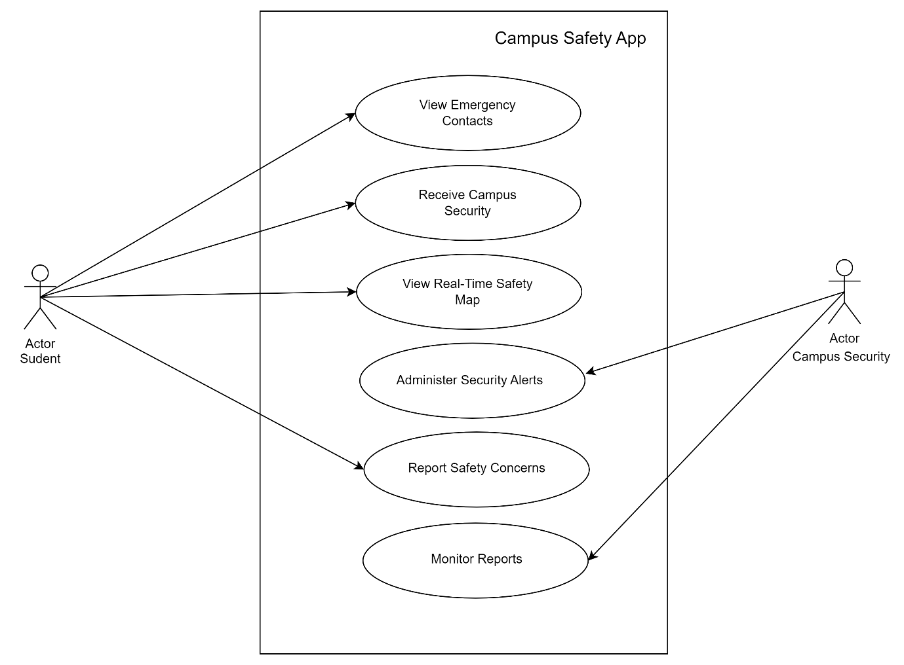

# Use Case Diagram

## Actors:

- **Student**: The primary user who interacts with the app for various safety-related features.
- **Campus Security**: The staff responsible for monitoring safety events, providing updates, and responding to emergencies.
- **App System**: The mobile application platform that interacts with both the students and campus security, providing necessary services.

## Use Cases:

1. **View Emergency Contacts**:  
   Students can view important emergency contacts, such as campus security, local police, hospital, etc.

2. **Receive Campus Security Updates**:  
   Students receive push notifications or alerts about security incidents or campus safety updates (e.g., lockdowns, warnings).

3. **View Real-Time Safety Map**:  
   Students can see a map of the campus with live safety information, such as areas with recent security incidents, active patrol routes, or evacuation zones.

4. **Report Safety Concerns**:  
   Students can report suspicious activity or other safety-related issues directly to campus security via the app.

5. **Administer Security Alerts**:  
   Campus security can send updates or alerts to students through the app.

6. **Monitor Reports**:  
   Campus security can view reported safety concerns, track incident reports, and respond as necessary.

## Relationships:

- **Student** can interact with the app to:

  - View emergency contacts.
  - Receive updates about campus security.
  - View the real-time safety map.
  - Report safety concerns.

- **Campus Security** interacts with the app to:
  - Administer security alerts.
  - Monitor reported safety concerns.

# Use Case Diagram

